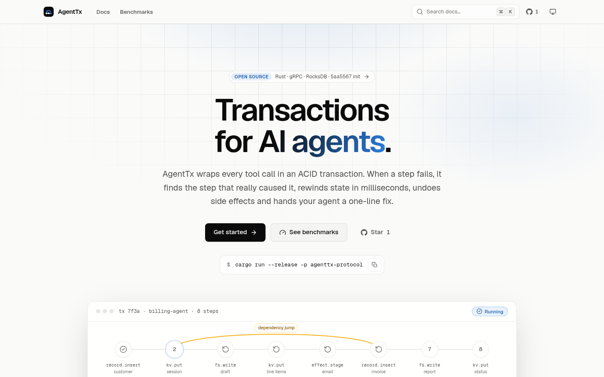

<div align="center">

<a href="https://agent-tx-protocol.vercel.app">
  <picture>
    <source media="(prefers-color-scheme: dark)" srcset=".github/assets/logo-dark.svg">
    
  </picture>
</a>

### ACID transactions for AI agent tool calls

Root-cause rollbacks · millisecond rewinds · Saga compensation · one-line Clean Hints

[](https://agent-tx-protocol.vercel.app)
[](https://github.com/harshal050/agent-tx-protocol/actions/workflows/ci.yml)
[](LICENSE)


**[Website](https://agent-tx-protocol.vercel.app)** · **[Documentation](https://agent-tx-protocol.vercel.app/docs)** · [Quickstart](https://agent-tx-protocol.vercel.app/docs/quickstart) · [Benchmarks](https://agent-tx-protocol.vercel.app/benchmarks) · [Contributing](CONTRIBUTING.md)

<br>

<a href="https://agent-tx-protocol.vercel.app">
  <picture>
    <source media="(prefers-color-scheme: dark)" srcset=".github/assets/website-dark.png">
    
  </picture>
</a>

</div>

AgentTx is an open-source Rust proxy that sits between an LLM agent and the tools it calls. Every tool call runs as a step inside a transaction. When a step fails, AgentTx:

1. **cleans the error** into a one-line hint with deterministic rules (no LLM call),
2. **traces the root cause** through a dependency graph of step inputs and outputs,
3. **rewinds everything**: RocksDB state from an undo journal, files and APIs through Saga undo actions, and emails or webhooks that were staged but never sent,
4. **resumes at the right step** within a replay budget that guarantees the loop terminates.

Your agent gets back `ROLLBACK_TRIGGERED`, the step to resume from, and the hint to put in its prompt.

```text
step 6  record.insert  ✕ ForeignKeyViolation (2.2 KB stack trace)
        Hint: Foreign key constraint failed for 'customer_id'.
        ↺ dependency jump → step 2 · state restored · draft undone · email discarded
        ✓ commit · 8 steps · email sent once
```

## Benchmarks

The same scripted agent and the same tools, run through a naive retry-and-restart loop (**before**) and through AgentTx (**after**). Measured on an AMD Ryzen 5 5600H (12 threads), release build. Explore every chart on the **[benchmarks page](https://agent-tx-protocol.vercel.app/benchmarks)** · raw data: [`benchmarks/results/latest.json`](benchmarks/results/latest.json) · [methodology](https://agent-tx-protocol.vercel.app/docs/benchmark-methodology).

| Scenario | Metric | Before | After |
|---|---|---:|---:|
| Silent root cause, 32 steps | Tool calls until success | 59 | **49** |
| | Error tokens added to the prompt | 1,029 | **27** |
| | Side effects left wrong | 5 | **0** |
| Unrecoverable failure, 64 steps | Tool calls until it stops | 204 | **106** |
| | Side effects left wrong | 76 | **0** |
| Transient timeout, any size | Tool calls | N + 1 | N + 2 |
| **All 12 scenarios** | **Duplicate, leaked or orphaned effects** | **148** | **0** |

| Cost of the transaction layer | p50 |
|---|---:|
| Direct RocksDB write, no protocol | 3.4 µs |
| AgentTx engine, embedded | 52.5 µs |
| AgentTx over gRPC (loopback) | 348 µs |
| Snapshot restore of 1,000 writes | 3.9 ms |
| Clean Hint from a real stack trace | ≤ 7.2 µs, median 81% smaller |

The per-step overhead is a few hundredths of a percent of a typical LLM round trip. In the transient case, AgentTx makes one *more* call than a plain retry, because a local backtrack re-runs the previous step. The agent is scripted rather than an LLM, and "side effects left wrong" counts duplicate emails, effects sent by failed runs, and orphaned files. Reproduce everything with:

```bash
cargo run --release -p agenttx-bench -- --out benchmarks/results/latest.json
```

## Quickstart

Prerequisites: Rust 1.88+, a C++ toolchain and libclang (RocksDB builds from source). See [Installation](https://agent-tx-protocol.vercel.app/docs/installation).

```bash
git clone https://github.com/harshal050/agent-tx-protocol.git
cd agent-tx-protocol
cargo run --release -p agenttx-protocol -- --listen-addr 127.0.0.1:50051
```

Or with Docker:

```bash
docker build -t agenttx .
docker run --rm -p 50051:50051 -v agenttx-data:/data agenttx
```

Then follow the [Quickstart](https://agent-tx-protocol.vercel.app/docs/quickstart) to trigger your first dependency-jump rollback with `grpcurl`, or wire up your agent with the [client integration guide](https://agent-tx-protocol.vercel.app/docs/client-integration) (Python, TypeScript, Rust).

## What's inside

| Capability | Details |
|---|---|
| Transactional state | Per-transaction overlay in RocksDB, atomic commit, first-committer-wins conflict detection |
| Snapshots | O(1) capture; restore cost proportional to the changes, not the database size |
| Rollback strategies | Dependency jump, local backtrack, global reset, abort, bounded by `c·N·⌈log₂(N+1)⌉` |
| Side effects | Crash-recoverable Saga undo actions; emails and webhooks staged until commit (outbox) |
| Clean Hints | About 30 rules for SQL, Python, Java, Node.js, Go, Rust and HTTP errors, plus a smart fallback |
| Transport | gRPC (`agenttx.v1.AgentTxService`) with health checks, or embed the Rust engine |

Read [Guarantees & limits](https://agent-tx-protocol.vercel.app/docs/guarantees) for exactly what is and isn't guaranteed.

## Repository layout

This is a Turborepo monorepo with a Cargo workspace inside it.

```text
crates/
  agenttx-protocol/   Rust server + library (gRPC, engine, storage, ledger, parser)
  agenttx-bench/      benchmark harness → benchmarks/results/latest.json
apps/
  docs/               website (Next.js): docs + benchmarks, content loaded from GitHub
packages/
  content/            GitHub/local content loader, Markdown pipeline, search index
  benchmarks/         result schema, formatting and derived metrics
  ui/                 shared React components and SVG charts
  eslint-config/      shared ESLint flat configs
  typescript-config/  shared tsconfig presets
docs/                 documentation source (Markdown), rendered by apps/docs
benchmarks/results/   committed benchmark results
```

## Development

```bash
pnpm install
pnpm dev          # website on http://localhost:3000
pnpm test         # Rust + TypeScript tests
pnpm lint         # rustfmt, clippy, ESLint
pnpm typecheck
pnpm bench:quick  # quick benchmark run
```

The website — live at **[agent-tx-protocol.vercel.app](https://agent-tx-protocol.vercel.app)** — reads `docs/` and `benchmarks/results/` from GitHub in production, falling back to the local checkout. A push webhook refreshes it. See [`apps/docs/README.md`](apps/docs/README.md) for deployment.

## Contributing

Contributions are welcome: new error rules, client examples, benchmark scenarios and docs fixes. Start with [CONTRIBUTING.md](CONTRIBUTING.md) and follow the [Code of Conduct](CODE_OF_CONDUCT.md). Report security issues privately as described in [SECURITY.md](SECURITY.md).

## License

[Apache License 2.0](LICENSE)
