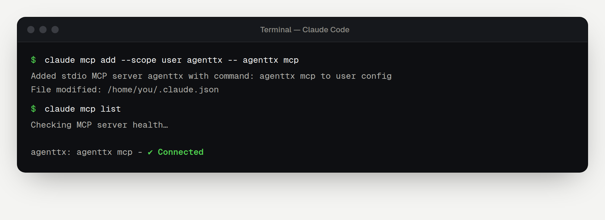

[Claude Code](https://www.anthropic.com/claude-code) is Anthropic's AI coding assistant for the terminal. Connecting AgentTx takes one command.

## Before you start

- [ ] AgentTx is installed and `agenttx --version` works ([Step 1–2 of the overview](./overview.md#step-1-install-agenttx)).
- [ ] Claude Code is installed and you have signed in at least once (run `claude` in a terminal).

## Step 1 — Add AgentTx

In your terminal, run:

```bash
claude mcp add --scope user agenttx -- agenttx mcp
```

What each part means:

| Part | Meaning |
|---|---|
| `claude mcp add` | Add a tool server to Claude Code |
| `--scope user` | Make it available in every project on this computer |
| `agenttx` | The name Claude Code will show |
| `-- agenttx mcp` | The command Claude Code runs to start AgentTx |

## Step 2 — Check the connection

```bash
claude mcp list
```

You should see `agenttx` with **✓ Connected**:



You can also start Claude Code with `claude` and type `/mcp`. AgentTx appears in the list of servers, with its six tools.

## Step 3 — Ask Claude to use AgentTx

Start Claude Code in any folder:

```bash
claude
```

Then paste this request:

```text
Use the AgentTx tools for this task. Begin a transaction, save the customer id
"c-404" with kv.put, then create invoice "inv-1" for that customer with
record.insert (reference customer_id to the customers table).
If AgentTx rolls back, follow its hint, then commit the transaction.
```

The first time Claude uses an AgentTx tool, Claude Code asks for permission. Choose **Yes**, or allow it for the whole session.

To see what happens next, step by step, read [Your first safe task](./first-task.md).

## Remove AgentTx

```bash
claude mcp remove --scope user agenttx
```

## Having trouble?

See [Troubleshooting](./troubleshooting.md). The most common fix is to use the full path from `agenttx connect claude-code` instead of just `agenttx`.
