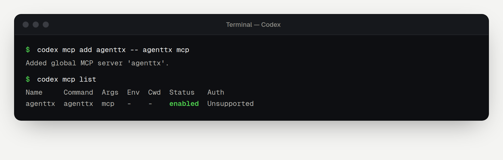

[Codex](https://github.com/openai/codex) is OpenAI's coding agent for the terminal. You can connect AgentTx with one command, or by adding three lines to a settings file.

## Before you start

- [ ] AgentTx is installed and `agenttx --version` works ([overview](./overview.md#step-1-install-agenttx)).
- [ ] Codex is installed and you have signed in (run `codex` once).

## Step 1 — Add AgentTx

### Option A: one command

```bash
codex mcp add agenttx -- agenttx mcp
```

### Option B: edit the settings file

Open `~/.codex/config.toml` in a text editor (create it if it doesn't exist) and add:

```toml
[mcp_servers.agenttx]
command = "agenttx"
args = ["mcp"]
```

Save the file. Both options do exactly the same thing.

## Step 2 — Check the connection

```bash
codex mcp list
```

`agenttx` should be listed with the command `agenttx mcp`:



Inside Codex, you can also type `/mcp` to see AgentTx and its tools.

## Step 3 — Ask Codex to use AgentTx

Start Codex:

```bash
codex
```

Then paste:

```text
Use the AgentTx MCP tools for this task. Begin a transaction, save the customer id
"c-404" with kv.put, then create invoice "inv-1" for that customer with
record.insert (reference customer_id to the customers table).
If AgentTx rolls back, follow its hint, then commit the transaction.
```

Codex may ask you to approve each tool call. Approve the AgentTx calls, then follow along in [Your first safe task](./first-task.md).

## Remove AgentTx

```bash
codex mcp remove agenttx
```

## Having trouble?

See [Troubleshooting](./troubleshooting.md).
