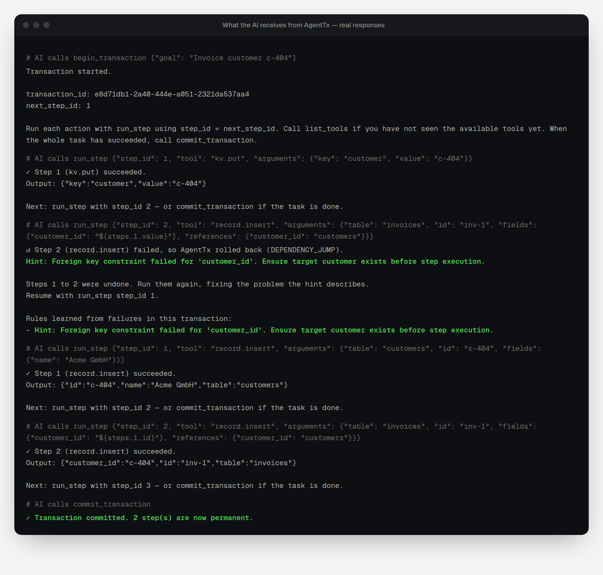

This walkthrough uses a small task that **goes wrong on purpose**, so you can see AgentTx at work. It works the same in every connected app.

## The request

Paste this into your AI app:

```text
Use the AgentTx tools for this task. Begin a transaction, save the customer id
"c-404" with kv.put, then create invoice "inv-1" for that customer with
record.insert (reference customer_id to the customers table).
If AgentTx rolls back, follow its hint, then commit the transaction.
```

The customer `c-404` does not exist, so the invoice can't be created. The mistake comes from **step 1** (a wrong id), but it only shows up at **step 2**.

## What happens, step by step

### 1. The AI starts a transaction

The AI calls `begin_transaction`. AgentTx replies with a `transaction_id` and tells the AI to start at step 1.

### 2. Step 1 saves the customer id

`run_step` with `kv.put` succeeds. Nothing looks wrong yet.

### 3. Step 2 fails — and AgentTx rolls back

The invoice needs a customer that exists. Without AgentTx, the AI would see a long database error and might retry step 2 forever. With AgentTx, it gets this:



In plain words, AgentTx:

1. **Explained the error in one line:** *Foreign key constraint failed for 'customer_id'. Ensure target customer exists before step execution.*
2. **Found the real cause.** The bad value came from step 1, so it undid steps 1 and 2 (a *dependency jump*).
3. **Told the AI where to continue:** *Resume with run_step step_id 1.*

### 4. The AI fixes the plan

Following the hint, the AI creates the customer first, then creates the invoice with the correct id. Both steps succeed.

### 5. The AI commits

`commit_transaction` makes the changes permanent. If there had been an email in the plan, it would be sent **now**, exactly once, and never for an attempt that failed.

## Try it yourself: more requests

**Files that clean up after themselves**

```text
Use AgentTx. Begin a transaction, write notes/plan.md with fs.write containing
"# Launch plan", then read a file called notes/missing.md with fs.read.
If a step fails, roll back the whole transaction and tell me what was undone.
```

The first write is undone when the transaction is rolled back. Check `~/.agenttx/workspace/notes`: the file is gone.

**Emails that wait for success**

```text
Use AgentTx. Begin a transaction, stage an email to team@example.com with
effect.stage saying "Report ready", then roll back the transaction.
Was the email sent?
```

The email is never sent, because it was staged and the transaction didn't commit.

## Tips for good results

- **Say "use the AgentTx tools"** in your request. Otherwise the AI may use its own built-in tools, which AgentTx doesn't protect.
- **Let the AI call `list_tools` first.** It shows every available tool, with example arguments.
- **Always finish** with `commit_transaction` or `rollback_transaction`. Transactions left open are cancelled automatically after an hour.
