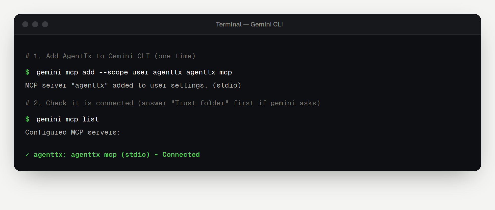

Every app below starts `agenttx mcp` for you. First install AgentTx and check that `agenttx --version` works ([overview](./overview.md#step-1-install-agenttx)).

## VS Code (GitHub Copilot)

### Step 1 — Add AgentTx

Run this in a terminal to print a ready-made command with your full path:

```bash
agenttx connect vscode
```

Copy and run the `code --add-mcp …` line it prints. It looks like this:

```bash
code --add-mcp '{"name":"agenttx","command":"/Users/you/.agenttx/bin/agenttx","args":["mcp"]}'
```

> [!TIP]
> Prefer a file? Create `.vscode/mcp.json` in your project with the `"servers"` block that `agenttx connect vscode` prints.

### Step 2 — Trust and check

1. Open VS Code and the **Chat** view, and switch to **Agent** mode.
2. When VS Code asks whether to trust the `agenttx` server, choose **Trust**.
3. Click **Configure Tools** in the chat box. `agenttx` and its tools should be listed and ticked.

### Step 3 — Try it

Paste the [first-task request](./first-task.md#the-request) into the chat.

---

## Gemini CLI

### Step 1 — Add AgentTx

```bash
gemini mcp add --scope user agenttx agenttx mcp
```

`--scope user` makes AgentTx available in every folder. Leave it out to add AgentTx only to the current project.

### Step 2 — Trust your folder

Gemini only turns on tools in folders you trust. Open your project folder in the terminal and start Gemini:

```bash
gemini
```

If Gemini asks **"Do you trust the files in this folder?"**, choose **Trust folder**. You only answer this once per folder. Type `/quit` to leave Gemini.

### Step 3 — Check the connection

```bash
gemini mcp list
```

`agenttx` should show a green tick and the word **Connected**:



> If it says **Disabled** instead of Connected, the folder isn't trusted yet. Go back to Step 2.

### Step 4 — Try it

Start `gemini` and paste the [first-task request](./first-task.md#the-request).

To remove it: `gemini mcp remove agenttx`.

---

## Windsurf

### Step 1 — Copy your settings

```bash
agenttx connect windsurf
```

Copy the settings block it prints.

### Step 2 — Add them to Windsurf

1. Open the MCP settings: click the **MCPs** icon at the top right of the Cascade panel, or go to **Settings → Cascade → MCP Servers**.
2. Open the raw configuration file, `~/.codeium/windsurf/mcp_config.json`.
3. Paste the block (or just the `"agenttx": { … }` entry, if the file already has `"mcpServers"`), and save.

### Step 3 — Restart and check

Restart Cascade. `agenttx` should now appear in the MCP servers list. Then paste the [first-task request](./first-task.md#the-request) into Cascade.

---

## Any other MCP app

AgentTx works with any app that supports **local (stdio) MCP servers**. Give the app:

| Setting | Value |
|---|---|
| Transport / type | `stdio` |
| Command | the full path from `agenttx connect` (for example `/Users/you/.agenttx/bin/agenttx`) |
| Arguments | `mcp` |

Optional arguments: `--home <folder>` changes where AgentTx keeps its data, and `--workspace <folder>` changes which folder `fs.write` can use.
