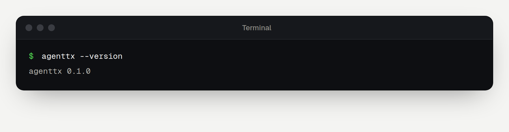
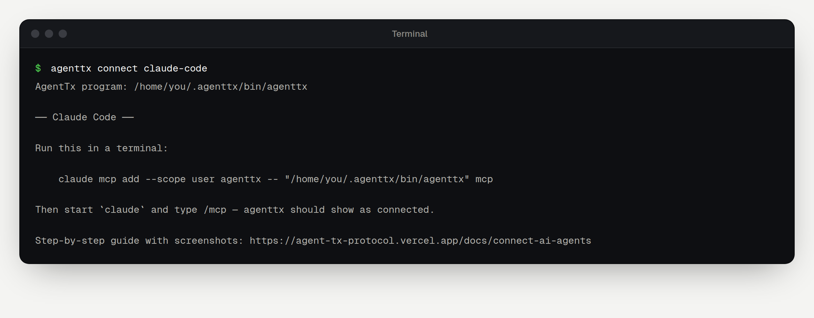

This guide connects AgentTx to the AI app you already use. You don't need to write code: you copy a few commands, and the guide shows what you should see after each one.

When you finish, your AI can run multi-step tasks through AgentTx. If a step goes wrong, AgentTx undoes the damage, tells the AI in one plain sentence what went wrong, and the AI continues from the right place.

## How it works

AI apps talk to extra tools through **MCP** (Model Context Protocol), a standard "plug" for AI tools. AgentTx has an MCP mode built in. Your AI app starts it in the background whenever it needs it, so you never have to run it yourself.

```text
┌──────────────────────┐    MCP     ┌─────────────────────────────┐
│  Your AI app         │ ─────────▶ │  agenttx mcp                │
│  Claude Code, Codex, │            │  runs on your computer      │
│  Cursor, Claude      │ ◀───────── │  • undoes failed steps      │
│  Desktop, VS Code…   │  results   │  • explains errors simply   │
└──────────────────────┘            └─────────────────────────────┘
```

Your AI gets six new tools: `begin_transaction`, `run_step`, `commit_transaction`, `rollback_transaction`, `get_transaction` and `list_tools`.

## Before you start

You need:

- **A computer** running macOS (Apple Silicon), Windows (64-bit) or Linux.
- **One AI app**, installed and signed in: Claude Code, Codex, Claude Desktop, Cursor, VS Code with GitHub Copilot, Gemini CLI or Windsurf.
- **About 10 minutes.**

You will type a few commands into a **terminal**:

| Your computer | How to open a terminal |
|---|---|
| macOS | Press <kbd>⌘</kbd> + <kbd>Space</kbd>, type **Terminal**, press <kbd>Enter</kbd> |
| Windows | Open **Start**, type **PowerShell**, press <kbd>Enter</kbd> |
| Linux | Press <kbd>Ctrl</kbd> + <kbd>Alt</kbd> + <kbd>T</kbd> |

To run a command, copy it from this page (use the copy button on each box), paste it into the terminal and press <kbd>Enter</kbd>.

## Step 1 — Install AgentTx

### Option A: one-line installer (recommended)

**macOS or Linux** — paste this into Terminal:

```bash
curl -fsSL https://agent-tx-protocol.vercel.app/install.sh | sh
```

**Windows** — paste this into PowerShell:

```powershell
irm https://agent-tx-protocol.vercel.app/install.ps1 | iex
```

The installer downloads AgentTx, checks the file is intact, and puts it in a folder called `.agenttx` in your home folder. When it finishes, **open a new terminal window**, so the terminal can find the new program.

> [!NOTE]
> The installer downloads ready-made programs from the project's [GitHub Releases](https://github.com/harshal050/agent-tx-protocol/releases). If it says the download failed or no release exists yet, use Option B.

### Option B: build from source

This takes longer (about 10 minutes the first time) but works on any computer.

1. **Install Rust.** Follow the one-line instructions at [rustup.rs](https://rustup.rs), then open a new terminal.
2. **Install a C++ compiler:**
   - macOS: `xcode-select --install`
   - Ubuntu or Debian Linux: `sudo apt-get install -y build-essential clang libclang-dev`
   - Windows: install [Visual Studio Build Tools](https://visualstudio.microsoft.com/visual-cpp-build-tools/) (select **Desktop development with C++**) and [LLVM](https://github.com/llvm/llvm-project/releases).
3. **Build and install AgentTx:**

```bash
cargo install --locked --git https://github.com/harshal050/agent-tx-protocol agenttx-protocol
```

## Step 2 — Check that AgentTx works

In a **new** terminal window, run:

```bash
agenttx --version
```

You should see the version number:



> [!TIP]
> If you see `command not found`, close the terminal, open a new one and try again. Still not working? See [Troubleshooting](./troubleshooting.md#agenttx-command-not-found).

## Step 3 — Get your setup instructions

AgentTx can print the exact setup for your app, already filled in with the location of the program on your computer:

```bash
agenttx connect
```

To see just one app, add its name: `claude-code`, `codex`, `claude-desktop`, `cursor`, `vscode`, `gemini` or `windsurf`.



## Step 4 — Connect your AI app

Open the page for your app and follow it from top to bottom:

| App | Kind | Guide |
|---|---|---|
| Claude Code | Terminal | [Connect Claude Code](./claude-code.md) |
| OpenAI Codex CLI | Terminal | [Connect Codex](./codex.md) |
| Claude Desktop | Desktop app | [Connect Claude Desktop](./claude-desktop.md) |
| Cursor | Code editor | [Connect Cursor](./cursor.md) |
| VS Code, Gemini CLI, Windsurf | Editor / terminal | [Connect other apps](./more-apps.md) |

## Step 5 — Try a safe task

Once your app is connected, follow [Your first safe task](./first-task.md). It shows AgentTx catching a mistake, undoing it and guiding the AI to the fix, with the exact messages you will see.

## What AgentTx protects

AgentTx protects the actions your AI runs **through AgentTx** with `run_step`:

| Protected | Example |
|---|---|
| Saved data | `kv.put`, `record.insert` — undone if a later step fails |
| Files in the AgentTx workspace | `fs.write` — the old file is restored on rollback |
| Emails and webhooks | `effect.stage` — held back and only sent after `commit_transaction` |

AgentTx does **not** wrap your app's own built-in tools. For example, when Claude Code edits your project files directly, or Codex runs a shell command, those happen outside AgentTx. Ask the AI to use the AgentTx tools for the steps you want protected.

## Where your data lives

| Folder | What's inside |
|---|---|
| `~/.agenttx/workspace` | Files created with `fs.write` |
| `~/.agenttx/rocksdb` | AgentTx's transaction database |
| `~/.agenttx/outbox.jsonl` | Emails and webhooks released by committed transactions |

(`~` is your home folder: `/Users/you` on macOS, `C:\Users\you` on Windows.)

To use a different folder, add `--home <folder>` after `mcp` in your app's settings. To let `fs.write` work inside a project, add `--workspace <project folder>`.
