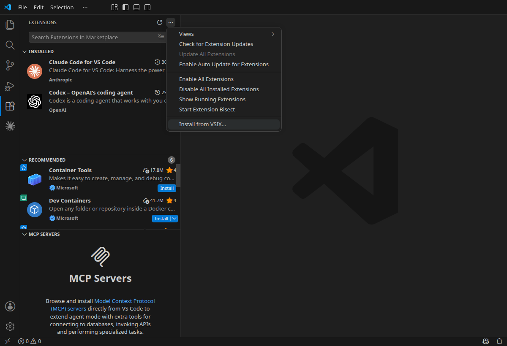
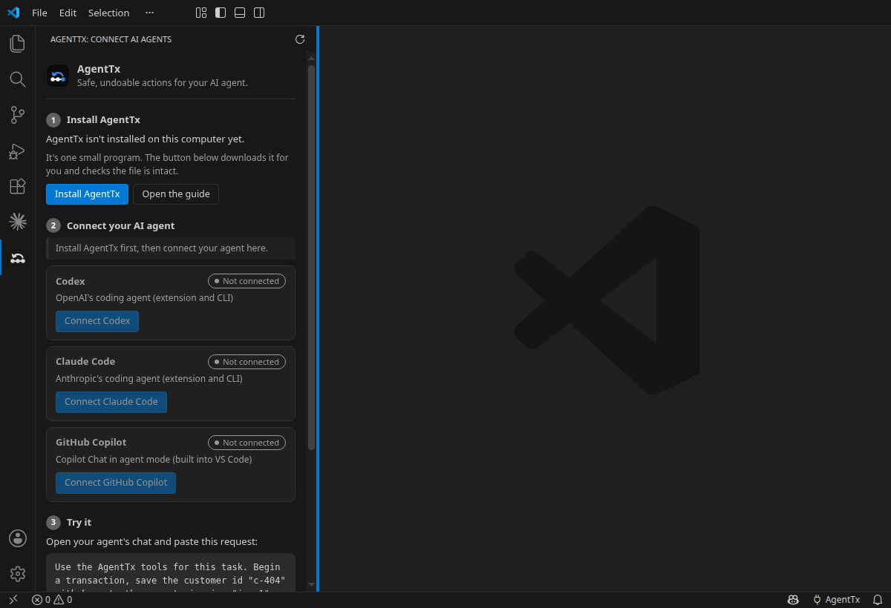
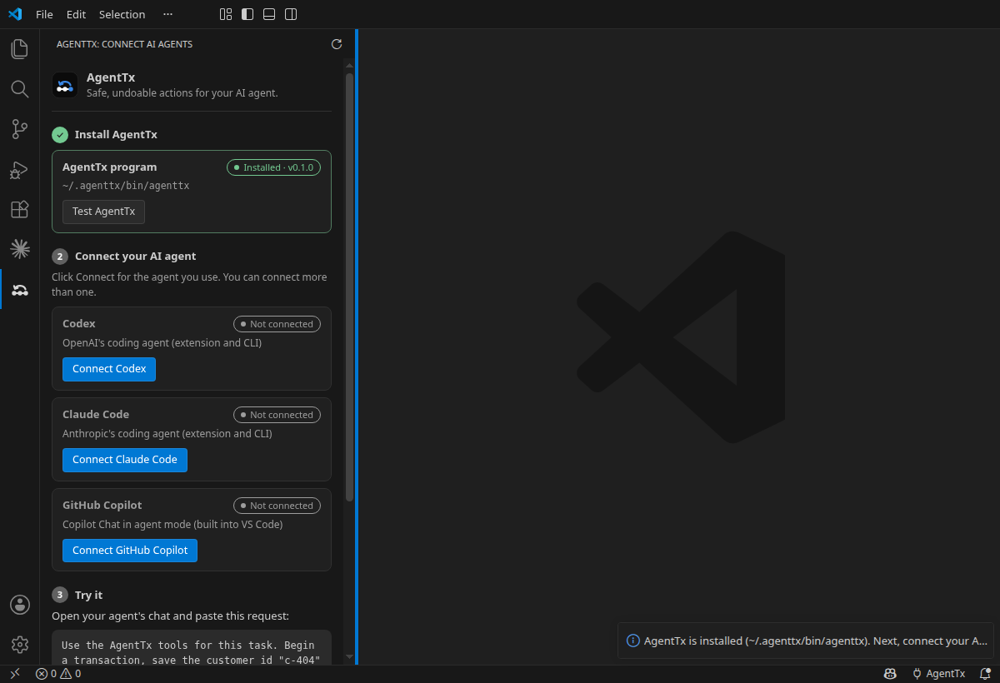
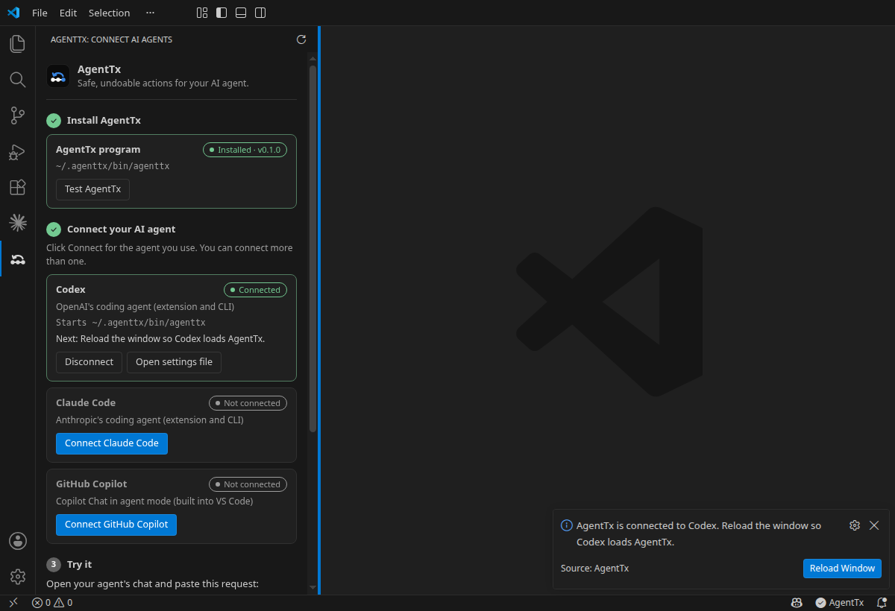
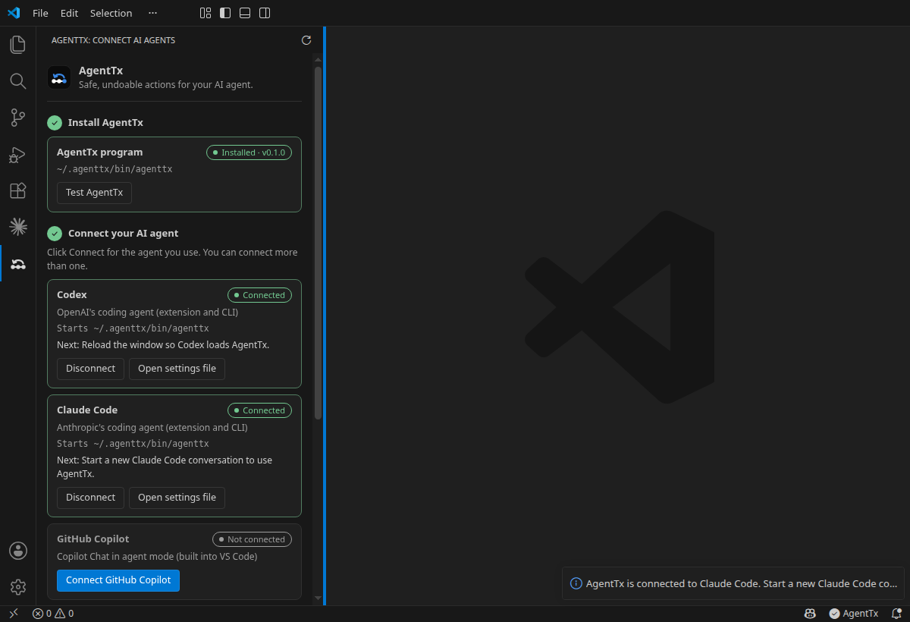
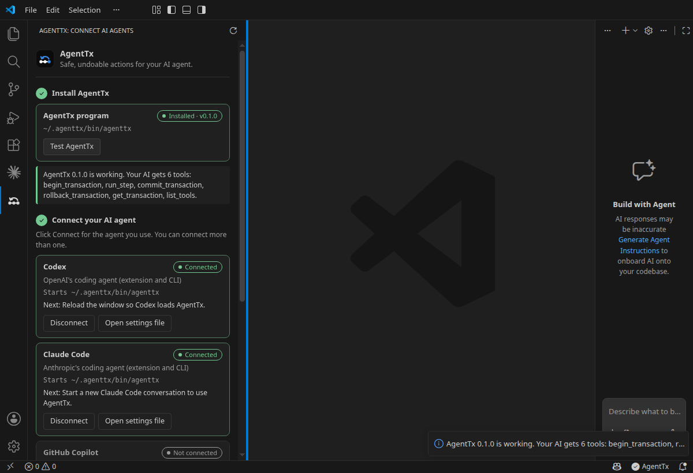
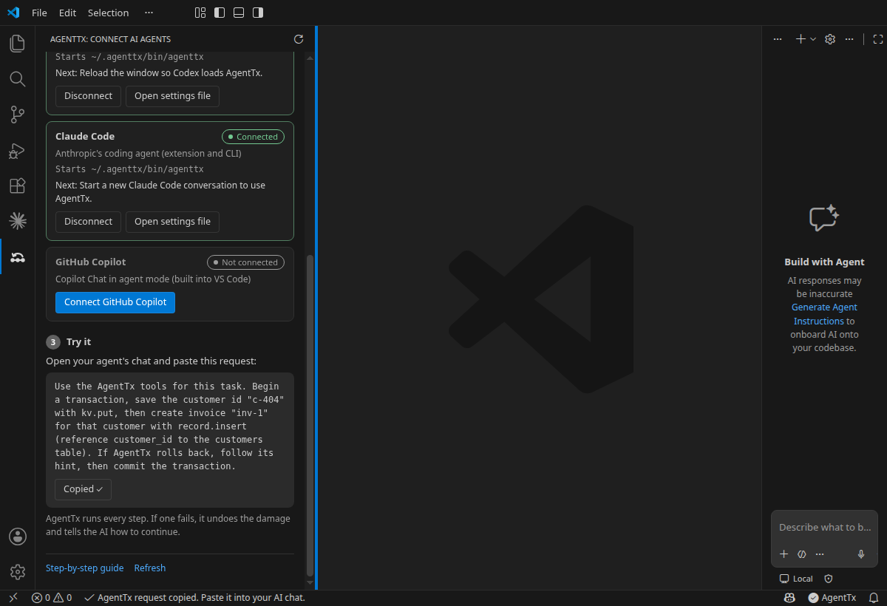
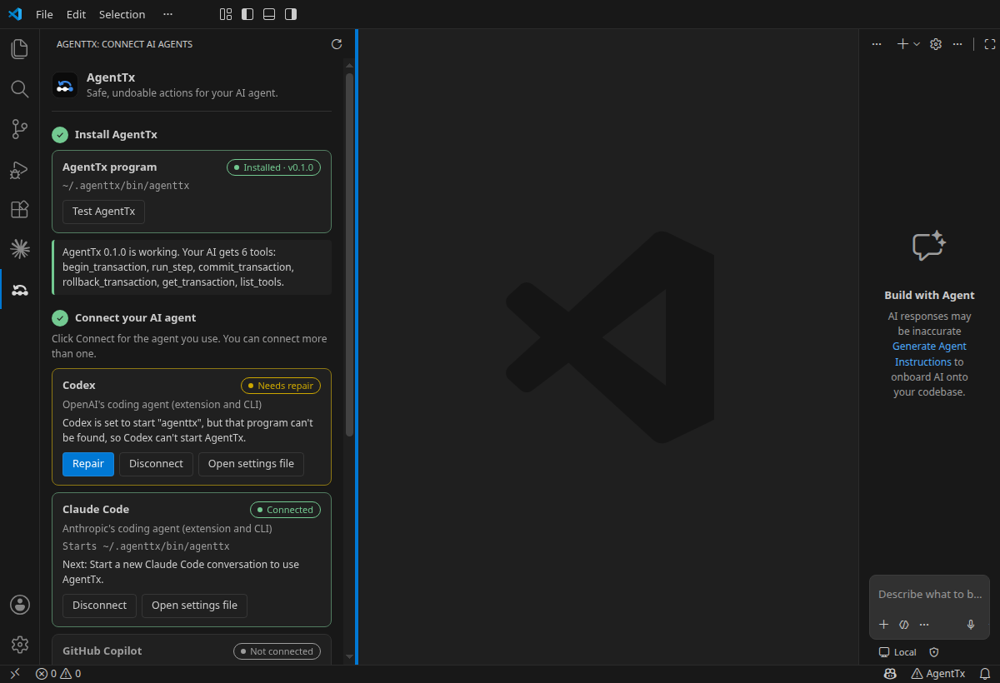
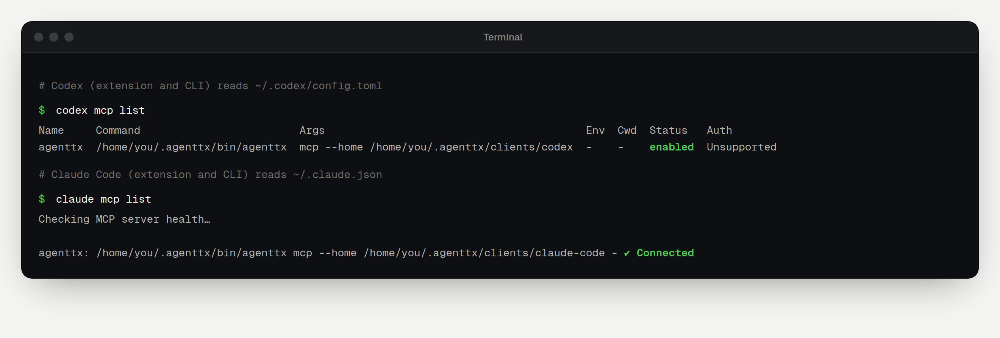

If you use **Codex**, **Claude Code** or **GitHub Copilot** inside VS Code, this is the easiest way to set up AgentTx. The extension installs AgentTx, connects it to your AI agent and checks that it works, all with buttons.

You don't need to open a terminal or edit any settings file.

## Before you start

- [ ] **VS Code** 1.101 or newer. To check, open **Help** → **About** (on macOS: **Code** → **About Visual Studio Code**).
- [ ] **Your AI agent** ready in VS Code and signed in: the **Codex** extension, the **Claude Code** extension, or **GitHub Copilot** (built into VS Code).
- [ ] A computer running **macOS** (Apple Silicon), **Windows** (64-bit) or **Linux**.

## Step 1 — Download the extension

1. Open the [latest AgentTx release](https://github.com/harshal050/agent-tx-protocol/releases/latest).
2. Scroll down to **Assets** and click **`agenttx-vscode.vsix`**. Your browser saves the file, usually in your **Downloads** folder.

> [!TIP]
> **Using Cursor, Windsurf or VSCodium?** These editors install extensions from [Open VSX](https://open-vsx.org/extension/harshal050/agenttx-vscode), where AgentTx is published. Open the Extensions view, search for **AgentTx** and click **Install**, then skip to Step 3.

## Step 2 — Install it in VS Code

1. In VS Code, open the **Extensions** view: click the Extensions icon in the bar on the left, or press <kbd>Ctrl</kbd> + <kbd>Shift</kbd> + <kbd>X</kbd> (<kbd>⌘</kbd> + <kbd>Shift</kbd> + <kbd>X</kbd> on macOS).
2. Click **⋯** (**Views and More Actions**) at the top of the Extensions view.
3. Click **Install from VSIX…** and choose the `agenttx-vscode.vsix` file you downloaded.

When it's installed, a new **AgentTx** icon appears in the bar on the left.

## Step 3 — Open the AgentTx panel

Click the **AgentTx** icon in the left bar. The panel walks you through three steps: install, connect, try.

## Step 4 — Install AgentTx

Click **Install AgentTx**. The extension downloads the right version for your computer, checks the file is intact and installs it. This takes a few seconds.

When it's done, step 1 shows a green **Installed** label:

> [!TIP]
> Already installed AgentTx with the [one-line installer](./overview.md#step-1--install-agenttx)? The panel finds it by itself and step 1 is already green.

## Step 5 — Connect your AI agent

Click the **Connect** button for the agent you use. You can connect more than one.

Then do the one thing your agent needs to load AgentTx:

| Agent | What to do next |
|---|---|
| **Codex** | Click **Reload Window** in the message that appears. |
| **Claude Code** | Start a **new conversation**. |
| **GitHub Copilot** | Open Copilot Chat, choose **Agent** mode, click **Configure Tools** and make sure **AgentTx** is ticked. |

Here both Codex and Claude Code are connected:

## Step 6 — Test it

Click **Test AgentTx** in step 1. The extension starts AgentTx the same way your agent does. A green message lists the six tools your AI now has:

## Step 7 — Try your first safe task

In step 3 of the panel, click **Copy request**. Open your agent's chat, paste the request and send it.

The first time your agent uses an AgentTx tool, it may ask for permission. Allow it. To see what happens step by step, read [Your first safe task](./first-task.md).

## If a card says "Needs repair"

This means your agent is set to start AgentTx, but it can't find the program. Codex shows this as **`No such file or directory (os error 2)`** or **"MCP startup failed"**. It usually happens when AgentTx was added with just the name `agenttx` instead of its full location.

Click **Repair**, then reload the window (Codex) or start a new conversation (Claude Code).

## Check it from a terminal (optional)

The extension writes the same settings as the terminal commands, so the command-line tools see AgentTx too:

## What the extension changes

| What | Where |
|---|---|
| The AgentTx program (only when you click **Install AgentTx**) | `~/.agenttx/bin` |
| Codex (extension and CLI) | adds `[mcp_servers.agenttx]` to `~/.codex/config.toml` |
| Claude Code (extension and CLI) | adds `agenttx` under `mcpServers` in `~/.claude.json` |
| GitHub Copilot | turns on the VS Code setting `agenttx.githubCopilot.enabled` |
| AgentTx data, one folder per agent | `~/.agenttx/clients/<agent>` |

- Nothing else in those files changes. Before every change, the extension saves the previous file next to it with the extension `.agenttx.bak`.
- **Disconnect** removes only the AgentTx entry.
- The extension sends no telemetry. Its only internet request is the download from GitHub Releases.

## Remove the extension

1. Click **Disconnect** on each connected agent.
2. In the **Extensions** view, find **AgentTx**, click the gear icon and choose **Uninstall**.
